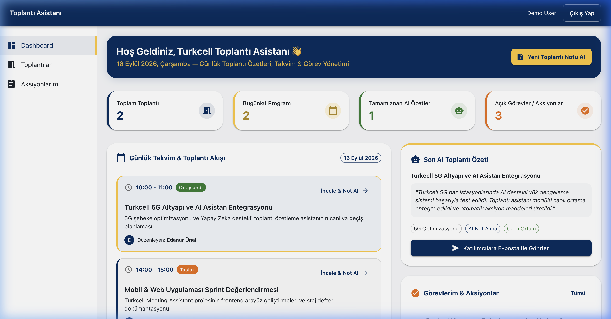
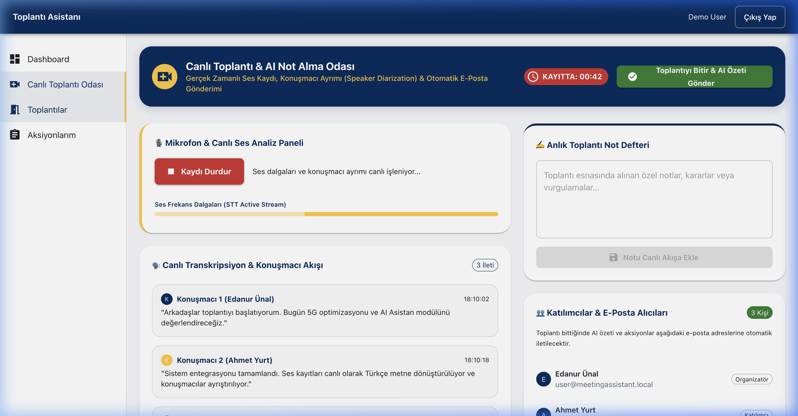
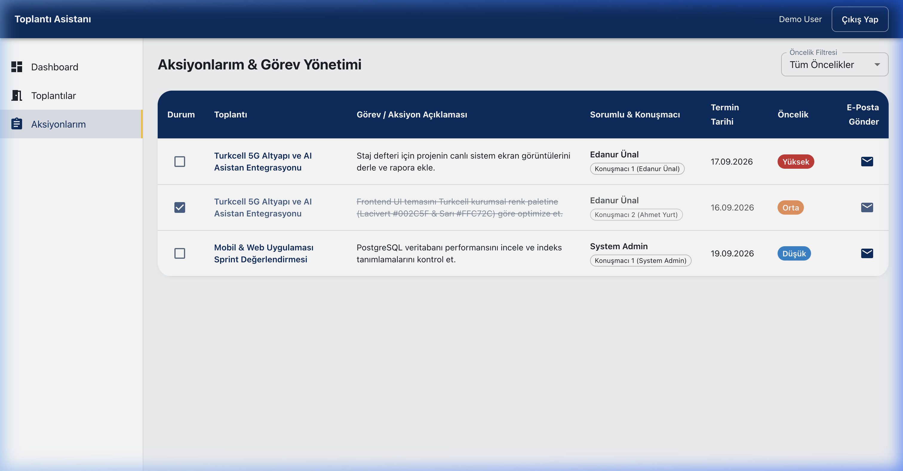
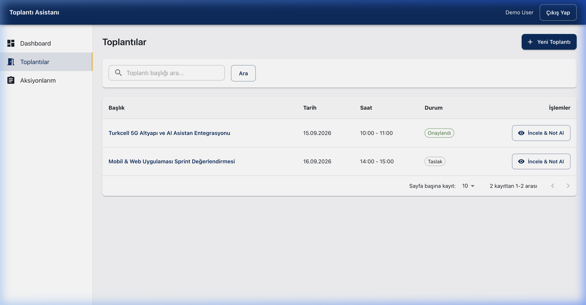
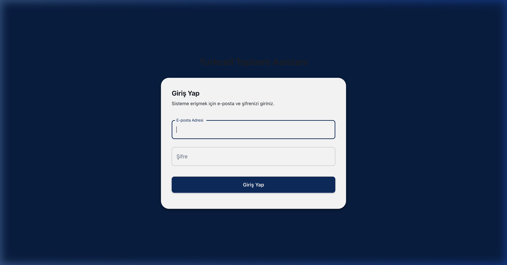
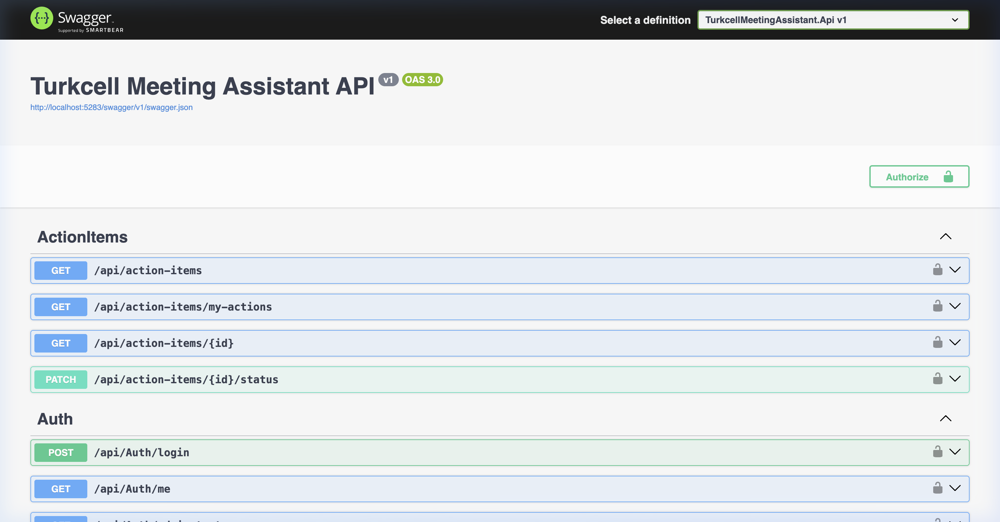

# 🚀 MEETURKCELL — Turkcell Toplantı Asistanı & AI Summarizer

<p align="center">
  
</p>

<p align="center">
  <b>Turkcell Kurumsal Renk Paleti (#002C5F Lacivert & #FFC72C Sarı Accent) ile Tasarlanmış Yapay Zeka Destekli Toplantı Not Alma, Konuşmacı Ayrımı, Özetleme ve E-Posta Dağıtım Platformu</b>
</p>

<p align="center">
  
  
  
  
  
</p>

---

## 📌 Proje Hakkında

**MEETURKCELL (Turkcell Meeting Assistant)**, kurum içi ve çevrim içi toplantıların verimliliğini maksimuma çıkarmak amacıyla geliştirilmiş **uçtan uca akıllı bir toplantı yönetim asistanıdır**.

Toplantılarda konuşulanları canlı mikrofon veya ses kaydı üzerinden **Speech-to-Text (STT)** ile metne dökebilir, **Çoklu Konuşmacı Ayrımı (Speaker Diarization)** gerçekleştirir, **OpenAI GPT-4o** entegrasyonu ile otomatik Yönetici Özeti, Alınan Kararlar ve Görev Maddeleri üretir ve tüm sonuçları katılımcıların e-posta adreslerine otomatik olarak iletir.

---

## ✨ Öne Çıkan Özellikler

### 1. 📅 Günlük Takvim & Akıllı Dashboard
- **Günlük Program Akışı**: Günün tarih bilgisi, toplantı başlangıç/bitiş saatleri, durum etiketleri (Onaylandı, Taslak) ve organizatör detayları.
- **Tek Tıkla Erişim**: Her toplantının yanında bulunan *"İncele & Not Al"* butonu ile detay sayfalarına hızlı geçiş.
- **İstatistik Kartları**: Toplam toplantı, bugünkü program, tamamlanan AI özetler ve açık aksiyonların canlı takibi.

### 2. 🎙️ Canlı Toplantı Odası & Konuşmacı Ayrımı (Speaker Diarization / STT)
- **Canlı Mikrofon Kaydı**: Tek tıkla canlı ortam ses kaydı başlatma, zaman sayacı (`00:04:12`) ve canlı ses dalgası frekans analizi.
- **Multi-Speaker Diarization**: Toplantıdaki farklı sesleri ayrıştırarak konuşmacı profili ve zaman etiketiyle sunar (`Konuşmacı 1 - Edanur Ünal`, `Konuşmacı 2 - Ahmet Yurt`).
- **Anlık Not Defteri**: Toplantı esnasında alınan özel notların canlı akışa eklenmesi ve yapay zeka analizine gönderilmesi.

### 3. 🤖 Yapay Zeka (AI) Özetleme Engine (GPT-4o Entegrasyonu)
- **Yönetici Özeti (Executive Summary)**: Toplantı içeriğinin kısa ve öz özeti.
- **Ana Kararlar (Key Decisions)**: Toplantıda kararlaştırılan stratejik başlıklar.
- **Aksiyon Maddeleri (Action Items)**: Güven skoru (*Confidence Score*) ile aksiyon maddelerinin ve sorumlularının otomatik tespiti.

### 4. ✉️ Otomatik E-Posta Bildirim Sistemi
- Toplantı sonlandığında veya özet onaylandığında, hazırlanan rapor ve aksiyon listesinin tüm katılımcı e-posta adreslerine tek tıkla iletilmesi.

### 5. ✅ Aksiyonlarım & Görev Yönetim Paneli (`/my-actions`)
- Kullanıcılara atanan görevlerin listelenmesi, öncelik rozetleri (`Yüksek`, `Orta`, `Düşük`), son teslim tarihleri ve canlı tamamlama onay kutuları.

---

## 🖼️ Ekran Görüntüleri Galerisi

### 1. 📊 Dashboard & Günlük Takvim


### 2. 🎙️ Canlı Toplantı & AI Not Alma Odası (`/meetings/live`)


### 3. ✅ Aksiyonlarım & Görev Yönetim Paneli (`/my-actions`)


### 4. 📋 Toplantı Listesi (`/meetings`)


### 5. 🔐 Turkcell Giriş Ekranı (JWT Auth)


### 6. 🛠️ Backend Swagger API Dokümantasyonu


---

## 🛠️ Teknoloji Yığını & Mimari

### 💻 Frontend Katmanı
- **Core Framework**: React 19 + TypeScript + Vite 8
- **UI & Tasarım**: Material UI v9 (Turkcell Kurumsal `#002C5F` Lacivert & `#FFC72C` Sarı palette)
- **State & Data Fetching**: TanStack React Query v5 + Axios
- **Form & Doğrulama**: React Hook Form + Zod
- **Tarih İşleme**: Day.js (Türkçe yerelleştirme ile)

### ⚙️ Backend Katmanı (.NET 8 Web API)
- **Mimari**: Clean Architecture (`Api`, `Application`, `Domain`, `Infrastructure`)
- **ORM & Veritabanı**: Entity Framework Core + PostgreSQL (`Npgsql`) & Development InMemory Fallback
- **Güvenlik & Yetkilendirme**: JWT Bearer Authentication (Role-based: `Admin`, `User`)
- **AI Servisleri**: OpenAI (GPT-4o), Azure OpenAI, Whisper Speech-to-Text Abstraction
- **Loglama & Doğrulama**: Serilog + FluentValidation

---

## 🔑 Giriş Bilgileri (Default Login Credentials)

Uygulama çalıştırıldığında veritabanı otomatik olarak aşağıdaki hazır hesaplarla seed edilir:

| Rol | E-Posta Adresi | Şifre |
| :--- | :--- | :--- |
| **Kullanıcı (Demo User)** | `user@meetingassistant.local` | `Password123!` |
| **Yönetici (Admin)** | `admin@meetingassistant.local` | `Password123!` |

---

## 🚀 Çalıştırma Rehberi

### Gereksinimler
- [.NET 8 SDK / .NET 9 Runtime](https://dotnet.microsoft.com/)
- [Node.js 18+](https://nodejs.org/) & npm
- [PostgreSQL](https://www.postgresql.org/) *(Opsiyonel - Postgres çalışmıyorsa EF Core InMemory fallback devreye girer)*

### 1. Backend Servisini Başlatma
```bash
# Proje kök dizininde:
dotnet build src/TurkcellMeetingAssistant.Api/TurkcellMeetingAssistant.Api.csproj
dotnet run --project src/TurkcellMeetingAssistant.Api/TurkcellMeetingAssistant.Api.csproj
```
Backend servisi `http://localhost:5283` adresinde dinlemeye başlar.  
Swagger API dokümantasyonuna `http://localhost:5283/swagger` adresinden erişebilirsiniz.

### 2. Frontend Uygulamasını Başlatma
```bash
# Frontend dizininde:
cd src/frontend
npm install
npm run dev
```
Frontend geliştirici sunucusu `http://localhost:5173` adresinde açılır.

---

## 👥 İletişim & Geliştirici

- **Geliştirici**: Edanur Ünal  
- **GitHub**: [@itsedanur](https://github.com/itsedanur)  
- **Proje Reposu**: [github.com/itsedanur/MEETURKCELL](https://github.com/itsedanur/MEETURKCELL)
